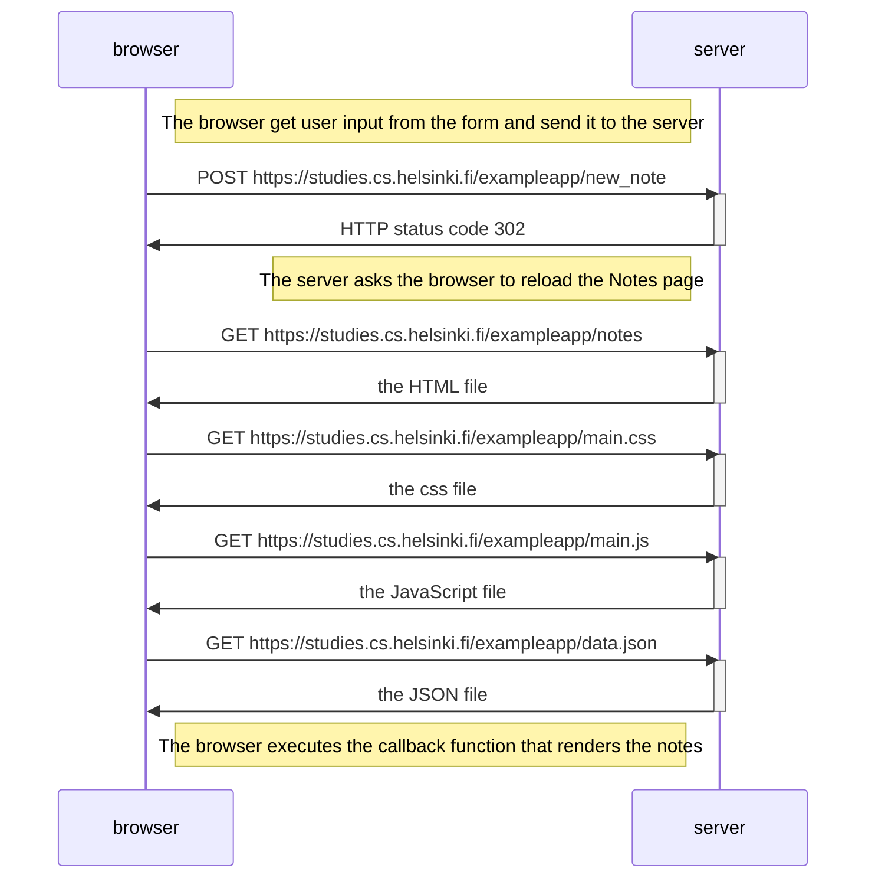

```mermaid

sequenceDiagram
   participant browser
   participant server

   Note right of browser: The browser get user input from the form and send it to the server

   browser->>server: POST https://studies.cs.helsinki.fi/exampleapp/new_note
   activate server
   server->>browser: HTTP status code 302
   deactivate server

   Note left of server: The server asks the browser to reload the Notes page
   browser->>server: GET https://studies.cs.helsinki.fi/exampleapp/notes
   activate server
   server->>browser: the HTML file
   deactivate server


   browser->>server: GET https://studies.cs.helsinki.fi/exampleapp/main.css
   activate server
   server->>browser: the css file
   deactivate server


   browser->>server: GET https://studies.cs.helsinki.fi/exampleapp/main.js
   activate server
   server->>browser: the JavaScript file
   deactivate server

   browser->>server: GET https://studies.cs.helsinki.fi/exampleapp/data.json
   activate server
   server->>browser: the JSON file
   deactivate server

   Note right of browser: The browser executes the callback function that renders the notes

```
