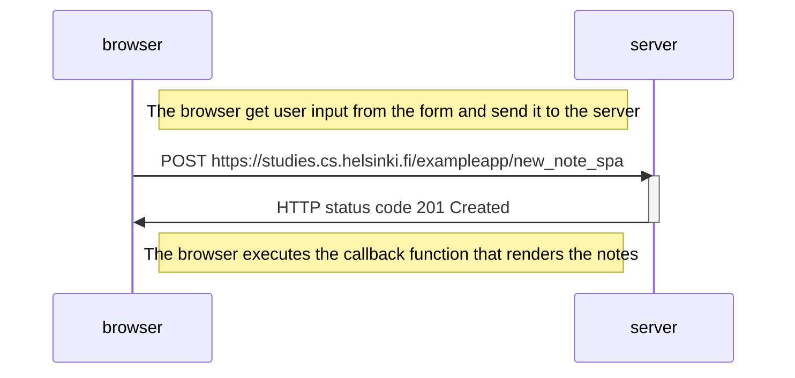

```mermaid

sequenceDiagram
   participant browser
   participant server

   Note right of browser: The browser get user input from the form and send it to the server

   browser->>server: POST https://studies.cs.helsinki.fi/exampleapp/new_note_spa
   activate server
   server->>browser: HTTP status code 201 Created
   deactivate server

   Note right of browser: The browser executes the callback function that renders the notes
```
