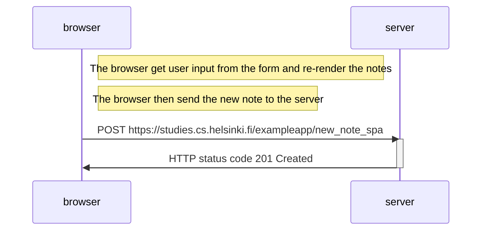

```mermaid

sequenceDiagram
   participant browser
   participant server

   Note right of browser: The browser get user input from the form and re-render the notes

   Note right of browser: The browser then send the new note to the server

   browser->>server: POST https://studies.cs.helsinki.fi/exampleapp/new_note_spa
   activate server
   server->>browser: HTTP status code 201 Created
   deactivate server


```
